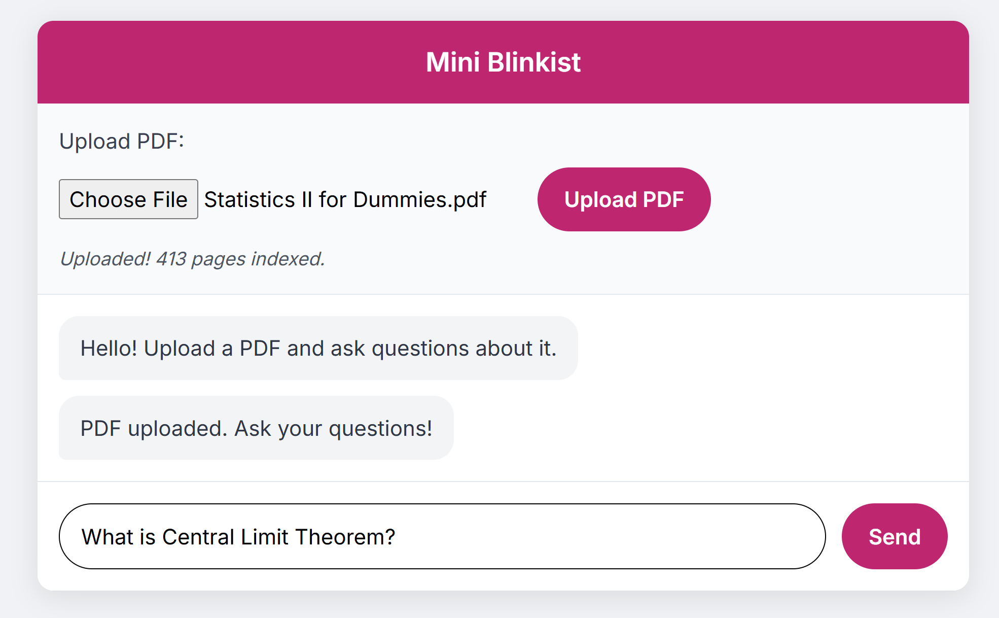

1. You must set your OpenAI API key before running the app.

Option A: Hardcode in app.py

Open app.py, and at line 30, replace the placeholder with your own OpenAI key:

OPENAI_API_KEY = "YOUR_OPENAI_API_KEY"

Option B: Set via Command Line (Windows)

Alternatively, you can set your API key as an environment variable:

setx OPENAI_API_KEY "sk-proj-xxxxxxxxxxxxxxxxxxxxxxxxxxxxxxxxxxxxxxxx"

2. Run the Project with Docker

To run the app and view the frontend interface:

Step 1: Build the Docker image
docker build -t mini_blinkist .

Step 2: Run the container

If you hardcoded your API key, just run:

docker run -p 5000:5000 mini_blinkist

If you're using the environment variable method, use:

docker run -p 5000:5000 -e OPENAI_API_KEY=%OPENAI_API_KEY% mini_blinkist

On Unix/macOS, replace %OPENAI_API_KEY% with $OPENAI_API_KEY.

3. Open the Web App

Once the container is running, open your browser and navigate to:

http://localhost:5000

You'll be able to upload a PDF and chat with its contents.

<h2>High-Level Description of the Approach</h2>

This project implements a <strong>PDF chatbot</strong> that allows users to upload PDF files and query their contents through a conversational interface.

<ul>
  <li><strong>Text Extraction</strong>  Extracts text from uploaded PDFs using <code>PyPDF2</code>.</li>
  <li><strong>Chunking & Indexing</strong>  Splits extracted text into smaller chunks (with overlap) using <code>RecursiveCharacterTextSplitter</code>.</li>
  <li><strong>Vector Database</strong> Uses <code>FAISS</code> to build a vector index of the PDF contents with embeddings generated by HuggingFace Sentence Transformers (<code>all-MiniLM-L6-v2</code>).</li>
  <li><strong>Retrieval-Augmented Generation (RAG)</strong>  On each query, retrieves the most relevant chunks from FAISS.</li>
  <li><strong>LLM Response Generation</strong>  Passes both the query and retrieved context into an OpenAI model (e.g., <code>gpt-3.5-turbo</code>) using LangChain’s <code>ChatOpenAI</code> and <code>create_retrieval_chain</code>.</li>
  <li><strong>Web Interface</strong> A Flask + Docker setup provides a simple frontend where users can upload PDFs and chat with them.</li>
</ul>

<h2>Trade-offs and Shortcuts</h2>

Due to time and complexity constraints, the following trade-offs and shortcuts were made:

<ul>
  <li><strong>Hardcoded API Key Option</strong>  For simplicity, the OpenAI API key can be hardcoded in <code>app.py</code>. In production, environment variables or secrets management should be used.</li>
  <li><strong>CPU-Only Embeddings</strong>  HuggingFace embeddings run on CPU for compatibility inside Docker, which may be slower than GPU acceleration.</li>
  <li><strong>Basic Frontend (Flask Templates)</strong>  Only a minimal HTML interface is provided; a richer React or Vue frontend could improve UX.</li>
  <li><strong>Simplified Chunking Parameters</strong>  Fixed chunk size and overlap are used (<code>1000/100</code>) instead of dynamically tuning for document length.</li>
  <li><strong>Error Handling</strong> Some errors (e.g., malformed PDFs) are handled minimally; production code should have more robust logging and retry logic.</li>
  <li><strong>Single Model Support</strong> Currently configured for OpenAI <code>gpt-3.5-turbo</code>; support for other providers/models could be added with minor changes.</li>
</ul>

<h2>How to improve security of this little app!</h2>

## 1. Configuration API
- The `OPENAI_API_KEY` is hardcoded in code.
- Running Flask with `debug=True` exposes stack traces.
### Fix
Load secrets from environment variables, and disable debug mode in production.
### Why
- Prevents leaks of sensitive keys via version control.
- Fail-fast ensures misconfiguration doesn’t go unnoticed.
- Removing debug=True stops sensitive error pages from being shown to end-users.

## 2. CORS
CORS (Cross-Origin Resource Sharing). browsers block web pages from making AJAX calls to a different origin (domain/protocol/port) by default (Same-Origin Policy).
- CORS is an “opt-in” in this code.
### Fix => Recommended CORS Configuration (Flask)
- Allow **only** trusted origins (production + dev).
- Deny credentials by default; enable only if you truly need cookies/Authorization headers from browsers.
- Keep **preflight** (OPTIONS) working.

## 3. Multi-tenancy isolation (data leak)
 Main problem is that the global vector_store shared by everyone; one user’s PDF answers another user’s query.

Fix: per-session store; require session_id. 
Why: prevents cross-user data exposure; foundation for auth later (JWT/API key).

## 4. LLM prompt-injection hardening

Problem: documents can contain “ignore previous instructions…” etc.
Fix: tighten the system prompt; discourage tool/secret leakage.

## 5. Dependency 

Problems: unused torch; unpinned requirements.

Fix: 
- Remove unused imports (e.g., torch).
- Pin versions and scan with pip-audit/safety.
- Avoid strict=False in PdfReader ...

## 6. Production serving

Problem: built-in Flask server isn’t hardened.
Fix: run behind Gunicorn/uvicorn with timeouts and multiple workers; terminate TLS upstream; add WAF if public.

gunicorn -w 4 -b 0.0.0.0:5000 'app:app' --timeout 60
Why: better isolation, concurrency, and resource controls.

<h2>Acknowledgements</h2>

This project makes use of several open-source tools and APIs:

<ul>
  <li><strong>OpenAI</strong> for powering the conversational model, generating summaries, and assisting with debugging/compiling errors during development.</li>
  <li><strong>LangChain</strong>  for building retrieval-augmented generation chains.</li>
  <li><strong>HuggingFace</strong>  for providing embeddings (<code>all-MiniLM-L6-v2</code>).</li>
  <li><strong>FAISS</strong>  for efficient similarity search and vector indexing.</li>
  <li><strong>Flask</strong>  for the lightweight web server and API endpoints.</li>
  <li><strong>Docker</strong>  for containerization and deployment.</li>
</ul>

